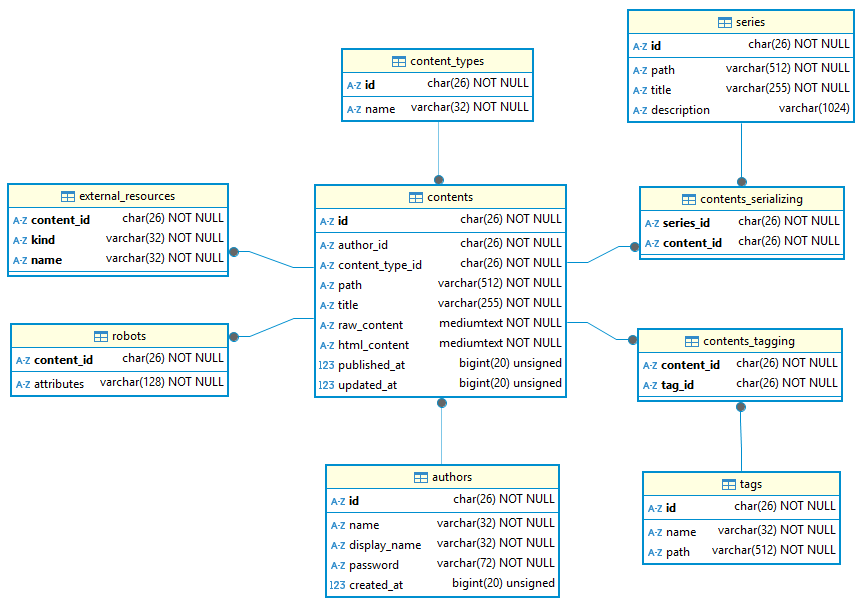

# Qualtet

*Qualtet is an API-based blogging system (server-side).*

> [Live (Qualtet is the backend for this site)](https://yoshinorin.net)

|| Version | CI/CD | Coverage | Docs |
|---|---|---|---|---|
| `v2.x` |-blue.svg?style=flat-square)||| |
| `v1.x` |-inactive.svg?style=flat-square)||||

## Related Projects

| Project | Description |
|---|---|
|[Qualtet](https://github.com/yoshinorin/qualtet)|API-based blogging system (server-side).|
|[Qualtet-CLI](https://github.com/yoshinorin/qualtet-cli)|A set of wrappers that call the APIs of [Hexo](https://github.com/hexojs/hexo) and [Qualtet](https://github.com/yoshinorin/qualtet).|
|[Quintet](https://github.com/yoshinorin/quintet)|The front end for Qualtet.|

About [Hexo](https://github.com/hexojs). Hexo is a SSG, but I'm using it only for local content management. (such as markdown, images, etc...) The contents of my website depend on Hexo locally. But basically, Qualtet doesn't necessarily need to depend on Hexo or any other SSG or CMS ...etc.

## Architecture (Example)

An example of architecture.

## Requirements

* sbt 1.9.x
* Scala 3.3.x
* Java 17.x (Perhaps works with 11.x)
* MariaDB 10.11.x
* docker & docker-compose 3.x (for test)

## Documentation

Please see [website](https://yoshinorin.github.io/qualtet/docs/).

* [Getting Started](./docs/_docs/getting-started/index.md)
    * [Docker Integration](./docs/_docs/docker/index.md)
* [Remarks](./docs/_docs/remarks/index.md)
* [REST API](https://yoshinorin.github.io/qualtet/rest-api/index.html)
    * [Examples](./docs/_docs/restapi/index.md)
* [Development](./docs/_docs/development/index.md)

## Releases

Please see [releases page](./docs/_docs/releases/index.md).

## ERD

## Using Stacks

|Stack|-|
|---|---|
|[Scala](https://www.scala-lang.org/)|-|
|[cats](https://github.com/typelevel/cats)| Functional programming library |
|[cats-effect](https://github.com/typelevel/cats-effect)| Pure asynchronous runtime |
|[http4s](https://github.com/http4s/http4s)| HTTP Server |
|[jsoniter-scala](https://github.com/plokhotnyuk/jsoniter-scala)| JSON codecs |
|[jwt-scalajwt-scala](https://github.com/jwt-scala/jwt-scala)| JWT support |
|[doobie](https://github.com/tpolecat/doobie)| JDBC Layer |
|[airframe-ulid](https://github.com/wvlet/airframe/)| ULID Generator |
|[caffeine](https://github.com/ben-manes/caffeine)| Caching library |
|[logback](https://github.com/qos-ch/logback)| Logging framework |
|[slf4j](https://github.com/qos-ch/slf4j)| Logging facade |
|[Spring Security](https://github.com/spring-projects/spring-security)| BCrypt password |
|[Flyway](https://flywaydb.org/)| Database Migration |
|[ScalaTest](http://www.scalatest.org/)| Unit test |
|[Mockito](https://github.com/mockito/mockito)| Mocking framework |
|[Scalafmt](https://scalameta.org/scalafmt/)| Code formatter |
|[GitHub Action](https://github.com/yoshinorin/cahsper/actions)| CI/CD |
|[COVERALLS](https://coveralls.io/github/yoshinorin/qualtet?branch=master)| Coverage report |
|[ReDoc](https://github.com/Redocly/redoc)| API documentation |
|[GitHub Pages](https://pages.github.com/)| Hosting WebSite & API docuementation |

## Branches

The current master branch is for `v2.x`. `v1.x` branch is [here](https://github.com/yoshinorin/qualtet/tree/v1.x). But it will be not updated.

## License

This code is open source software licensed under the [Apache 2.0 License](https://www.apache.org/licenses/LICENSE-2.0.html).
