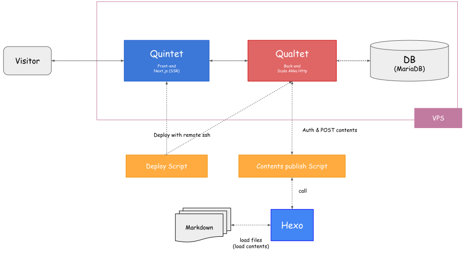

# Qualtet

*Qualtet is an API-based blogging system (server-side).*

> [Live (Qualtet is a backend of this site)](https://yoshinorin.net)

|Latest|Build|Coverage|API Doc|
|---|---|---|---|
|||||

## Related Repositories

|||
|---|---|
|[Qualtet](https://github.com/yoshinorin/qualtet)|API-based blogging system (server-side).|
|[Quintet](https://github.com/yoshinorin/quintet)|The front end for Qualtet.|
|[Hexo](https://github.com/hexojs)|Hexo is SSG, but I'm using it for just local content management. (markdown, images, etc...) My website's contents depend on Hexo locally. But basically, Qualtet no needs to depend on Hexo and any SSG, cms ...etc.|

## Architecture (Example)

An example of architecture.

## Requirements

* sbt 1.7.x
* Scala 2.13.x
* Java 11.x, 17.x
* MariaDB 10.6.x
* docker & docker-compose 3.x (for test)

## Documentation

* [API](https://yoshinorin.github.io/qualtet/)
* [Features](./docs/features.md)
* [Set up](./docs/setup.md)
* [Remarks](./docs/remarks.md)
* [Examples](./docs/examples.md)
* [Development](./docs/development.md)

## License

This code is open source software licensed under the [Apache 2.0 License](https://www.apache.org/licenses/LICENSE-2.0.html).
