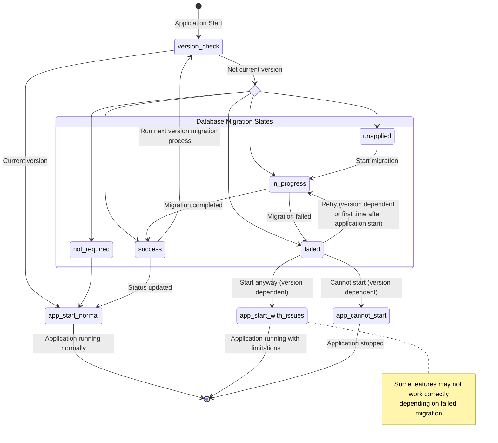

**NOTE: This file is not included in `sbt doc` command result. Please export the preview result of `Mermaid.js` as an image file and use that instead.**

```mermaid
stateDiagram-v2
    [*] --> version_check: Application Start

    state "Database Migration States" as db_status {
        not_required_state : not_required
        unapplied_state : unapplied
        in_progress_state : in_progress
        success_state : success
        failed_state : failed
    }

    version_check --> app_start_normal: Current version
    state if_state <<choice>>
    version_check --> if_state: Not current version

    if_state --> not_required_state
    if_state --> unapplied_state
    if_state --> failed_state
    if_state --> in_progress_state
    if_state --> success_state

    unapplied_state --> in_progress_state: Start migration

    in_progress_state --> success_state: Migration completed
    in_progress_state --> failed_state: Migration failed

    failed_state --> in_progress_state: Retry (version dependent or first time after application start)
    failed_state --> app_start_with_issues: Start anyway (version dependent)
    failed_state --> app_cannot_start: Cannot start (version dependent)

    not_required_state --> app_start_normal
    success_state --> app_start_normal: Status updated
    success_state --> version_check: Run next version migration process

    app_start_normal --> [*]: Application running normally
    app_start_with_issues --> [*]: Application running with limitations
    app_cannot_start --> [*]: Application stopped

    note right of app_start_with_issues
        Some features may not work correctly
        depending on failed migration
    end note
```
